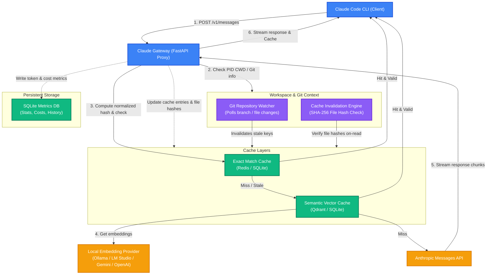
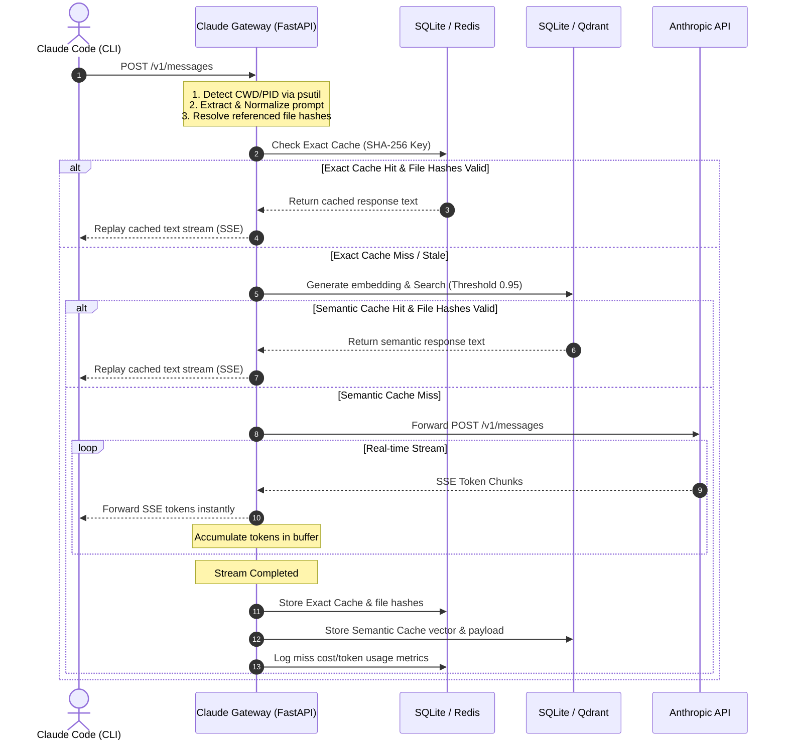

# Architecture Details

Claude Gateway acts as a high-performance HTTP proxy between the **Claude Code** CLI client and the **Anthropic Messages API**.

---

## System Architecture

The following block diagram illustrates the subsystems, databases, background workers, and external connections within the Claude Gateway:

---

## Request Lifecycle

The diagram below details how a request is processed from client entry to streaming completion:

---

## Architectural Subsystems

### 1. Context Resolution (`gateway/git/context.py` & `repository.py`)
- **Local PID Tracking**: Inspects system connections to link the client's TCP socket port to the process ID (PID) on the host machine.
- **Directory Path Lookup**: Inspects the PID's execution environment to extract the current working directory (CWD), walking up the tree to locate the `.git` folder.
- **Repository Identifiers**: Pulls the active branch, commit hash, and working tree modification status directly from git files (very fast) or fallback CLI commands.

### 2. Cache Invalidation Control (`gateway/cache/invalidation.py`)
- **Regex Normalization**: Strips polite phrases and compacts spacing so minor syntax variations hit the cache.
- **Workspace Verification**: Scans prompt text for filenames, checks if they exist in the repository, and hashes them using SHA-256.
- **Lazy Check**: Validates that files are in their cached state on read before returning a hit. Stale caches are immediately evicted.
- **Background Watcher**: Polls repository directories. If a branch changes or `git status` reveals a file modification, any cached prompt linked to that file is immediately deleted.

### 3. Exporter & Metrics (`gateway/metrics/prometheus.py` & `storage/sqlite.py`)
- Log entries are written to a lightweight SQLite database recording tokens avoiding/spent and calculated cost values.
- Exposes standard `/metrics` endpoints for scrape-based Grafana dashboard configurations.
- Serves an embedded responsive single-page analytics dashboard for developers.
